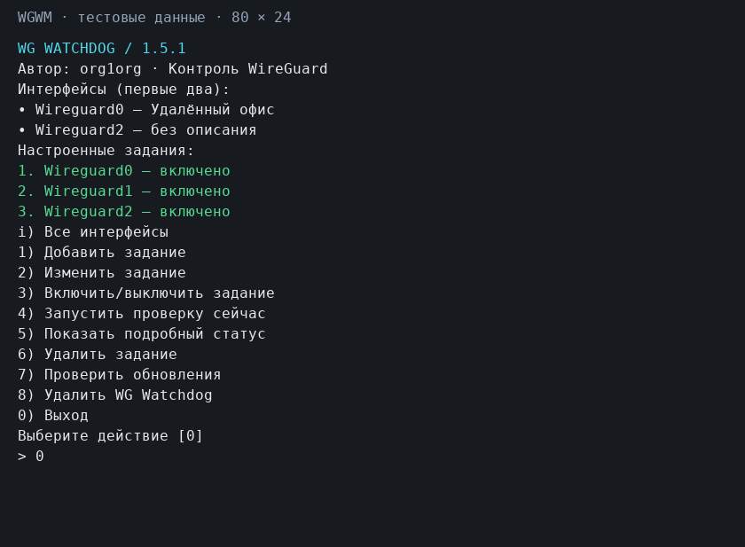

# WG Watchdog для KeeneticOS

Интерактивный менеджер watchdog-заданий для WireGuard на роутерах Keenetic с установленным Entware.

Для каждого WireGuard-интерфейса создаётся отдельное задание. Watchdog отличает отсутствие обычного интернета или отключённый сервер от неисправности туннеля, учитывает несколько последовательных ошибок и не допускает слишком частых перезапусков.

## Возможности

- находит WireGuard-интерфейсы Keenetic и показывает их описания;
- поддерживает несколько независимых заданий — по одному на каждый интерфейс;
- позволяет добавлять, изменять, включать, выключать и удалять задания;
- выделяет настроенные задания зелёным цветом и нумерует их с точкой;
- показывает состояние, последнюю проверку, последний успех и последний перезапуск;
- запускает выбранное задание вручную, даже если оно отключено;
- требует несколько неудачных проверок подряд перед перезапуском;
- соблюдает паузу `cooldown` между повторными перезапусками;
- ждёт завершения загрузки роутера перед первой проверкой;
- необязательно проверяет публичный адрес WG-сервера;
- не перезапускает WireGuard при отсутствии обычного интернета;
- защищает каждое задание от одновременного запуска;
- автоматически устанавливает и запускает `cron`, сохраняя посторонние задания;
- проверяет наличие новой версии по небольшому файлу `VERSION` и обновляется из меню;
- устанавливает короткую команду `wgwm`, если это имя не занято;
- полностью удаляет программу и её задания из меню, не затрагивая сторонний cron;
- переносит конфигурации версий 1.0.0 и 1.1.0;
- пишет сведения о проверках, перезапусках и ошибках в системный журнал.

## Требования

- KeeneticOS 5 или новее;
- установленный и запущенный Entware;
- SSH-доступ к Entware от пользователя `root`;
- WireGuard-интерфейс, настроенный средствами KeeneticOS;
- внутренний адрес WG-сервера, который отвечает на ICMP через туннель.

## Установка и управление

Подключитесь к Entware по SSH от `root` и выполните:

```sh
wget -qO- https://raw.githubusercontent.com/org1org/wg-watchdog/main/install.sh | sh
```

При первой установке показывается краткое назначение программы и вопрос `[Y/n]`. После подтверждения установщик загружает менеджер и исполнитель проверки, создаёт команду `wgwm`, показывает список установленных файлов и полезные команды, после чего завершает работу. Менеджер автоматически не запускается.

Если выполнить установочную команду повторно при уже установленной версии 1.3.0 или новее, файлы не скачиваются повторно — просто запускается существующий менеджер. Проверка обновления уже встроена в `wgwm`.

Для принудительной переустановки файлов используйте:

```sh
wget -qO- https://raw.githubusercontent.com/org1org/wg-watchdog/main/install.sh | sh -s -- --force
```

Ключи `--force` и `-force` равнозначны. При принудительной переустановке вопрос не задаётся, поскольку сам ключ уже явно подтверждает действие.

После установки менеджер можно запускать локально:

```sh
wgwm
```

Установщик создаёт `/opt/bin/wgwm` как символическую ссылку на менеджер. Если команда или файл с таким именем уже существует, он ничего не перезаписывает и сообщает, что следует использовать полный путь `/opt/bin/wg-watchdog-manager`.

В шапке менеджера показаны назначение программы, автор и версия. Затем выполняется лёгкая проверка обновлений, выводятся найденные WireGuard-интерфейсы и открывается основное меню. Если заданий ещё нет, доступны «Добавить задание», «Проверить обновления», «Удалить WG Watchdog» и «Выход». После создания первого задания появляется полное меню управления.

Команда `wgwm` сразу открывает менеджер без дополнительного вопроса о продолжении. Необязательные действия внутри настройки используют `[y/N]`, где Enter означает `no`. Информационные этапы выделяются цветом и отделяются пустыми строками от вывода системных команд. Для отключения цвета используйте `NO_COLOR=1 wgwm`.

В совместимом SSH-терминале менеджер занимает отдельный экран. Меню перерисовывается
на месте, результаты действий показываются страницами с подтверждением Enter,
при выходе восстанавливается обычная консоль. Новый экран не требует curses,
dialog или Python на роутере.

Вверху показаны первые два интерфейса; `i` открывает полный список. Задания
отображаются по три, `n` переключает страницы. Номера заданий остаются общими.
На экране 80×24 основное меню помещается целиком; в меньшем окне длинный вывод
разбивается на страницы. Размер окна учитывается при следующей перерисовке.
Очень длинные слова без пробелов могут обрезаться по ширине терминала;
для полной диагностики предусмотрен `wgwm --plain`.



Настроенные задания выводятся как `1.`, `2.`, а действия меню — как `1)`, `2)`, поэтому два списка визуально не смешиваются. При редактировании задания интерфейс повторно не запрашивается: он является идентификатором задания. Чтобы перенести настройки на другой интерфейс, создайте для него новое задание и удалите старое.

## Рекомендуемые значения

При создании нового задания менеджер не спрашивает каждый числовой параметр, а сразу применяет рекомендуемый профиль из таблицы и показывает итог. При необходимости значения можно изменить через пункт «Изменить задание» — в этом режиме Enter принимает текущее значение.

| Параметр | По умолчанию | Допустимо | Назначение |
| --- | ---: | ---: | --- |
| `CHECK_INTERVAL` | `5` | специальный список | Частота проверки в минутах |
| `PING_COUNT` | `3` | 1–10 | Число ICMP-запросов за одну проверку |
| `PING_TIMEOUT` | `3` | 1–30 | Ожидание каждого ответа, секунд |
| `FAILURE_THRESHOLD` | `2` | 1–10 | Неудачных проверок подряд до перезапуска |
| `RESTART_DELAY` | `3` | 1–60 | Пауза между выключением и включением интерфейса, секунд |
| `RECOVERY_CHECK_DELAY` | `15` | 1–300 | Ожидание контрольной проверки после перезапуска, секунд |
| `RESTART_COOLDOWN` | `30` | 1–1440 | Минимальная пауза между перезапусками, минут |
| `BOOT_GRACE` | `180` | 1–3600 | Пауза после загрузки роутера, секунд |

Поддерживаются только интервалы, которые точно укладываются в час: `1`, `2`, `3`, `4`, `5`, `6`, `10`, `12`, `15`, `20`, `30` и `60` минут. Это исключает неравномерность cron-выражений наподобие `*/7` на границе часа.

Три ping-запроса и две последовательные проверки означают, что единичная кратковременная потеря пакетов не вызовет перезапуск. Увеличивать `PING_COUNT` до пяти обычно не требуется.

## Публичный адрес WG-сервера

Публичный IP или DNS-имя сервера указывать необязательно. При создании задания эта проверка выключена по умолчанию и включается отдельным ответом `yes`. Если адрес задан, watchdog сначала проверяет его доступность:

- публичный адрес недоступен — сервер считается выключенным, перезапуск интерфейса пропускается;
- публичный адрес доступен, но внутренний адрес не отвечает — неисправным считается туннель;
- поле пустое — эта дополнительная проверка не выполняется.

Перед вопросом менеджер кратко объясняет механизм и предупреждает о риске. Используйте публичную проверку только тогда, когда сервер стабильно отвечает на ICMP из интернета. При статическом белом IP предпочтительно указывать сам IP, а не DNS-имя. При редактировании задания уже включённая проверка сохраняется по Enter через вопрос `[Y/n]`.

## Автоматическое определение адресов

После выбора WireGuard-интерфейса менеджер анализирует соответствующий раздел `show running-config`:

- внешний адрес берётся из `endpoint`, номер UDP-порта отбрасывается;
- внутренний адрес берётся из одиночного маршрута `/32` в `allow-ips`;
- если у интерфейса несколько пиров, менеджер предлагает выбрать нужный;
- найденные значения предлагаются как значения по умолчанию и их можно исправить вручную.

WireGuard не хранит внутренний адрес удалённого сервера отдельным параметром. Если в `Allowed IPs` настроена только целая подсеть или маршрут `0.0.0.0/0`, однозначно определить адрес сервера невозможно — менеджер оставит поле для ручного ввода.

## DNS и число ping-запросов

DNS-имя разрешается до отправки ICMP-пакетов. Роутер не расходует первые ping-запросы на DNS. Если имя не удалось разрешить, весь запуск `ping` завершается ошибкой, а увеличение `PING_COUNT` с трёх до пяти не исправляет DNS.

Такая ошибка учитывается как одна неудачная проверка watchdog. По умолчанию перезапуск разрешается только после второй неудачной проверки.

## Как принимается решение

1. Во время `BOOT_GRACE` проверка откладывается.
2. Проверяется обычный интернет через `1.1.1.1` и `8.8.8.8`.
3. Если настроен публичный адрес сервера, проверяется его доступность.
4. Проверяется внутренний адрес сервера через WireGuard.
5. Первая ошибка только сохраняется в состоянии задания.
6. После достижения `FAILURE_THRESHOLD` проверяется `RESTART_COOLDOWN`.
7. Выполняются `interface WireguardN down` и `interface WireguardN up` через `ndmc`.
8. После паузы выполняется контрольная проверка и сохраняется результат.

## Файлы

- `/opt/bin/wg-watchdog-manager` — интерактивный менеджер;
- `/opt/bin/wgwm` — короткая ссылка для запуска менеджера;
- `/opt/bin/wg-watchdog.sh` — исполнитель проверки;
- `/opt/etc/wg-watchdog.d/WireguardN.conf` — настройки каждого интерфейса;
- `/tmp/wg-watchdog/WireguardN.state` — состояние последней проверки в оперативной памяти;
- `/opt/etc/crontab` — автоматически управляемые строки запуска;
- `/opt/etc/crontab.wg-watchdog.bak` — резервная копия crontab;
- `/tmp/wg-watchdog/wg-watchdog-WireguardN.lock` — блокировка параллельного запуска в оперативной памяти.

Конфигурации и файлы состояния сохраняются с правами `600`.

## Использование памяти и накопителя

Часто изменяющееся состояние, PID-блокировки и загружаемые временные файлы размещаются в `/tmp`, то есть в оперативной памяти роутера. После перезагрузки они создаются заново — постоянное хранение для них не требуется.

На накопитель `/opt` записываются только сама программа, конфигурации и crontab. Менеджер сравнивает содержимое перед заменой и не перезаписывает неизменившиеся файлы при повторном запуске. Одинаковые ошибки записываются в системный журнал только при изменении состояния, а не при каждом запуске cron.

Установленная программа занимает около 64 КБ без учёта конфигураций. Компактный установщик,
тестовый стенд и изображение интерфейса на роутер не устанавливаются.

При запуске менеджер скачивает только небольшой текстовый файл `VERSION` во временный каталог `/tmp`. Если найдена новая версия, вверху появляется заметное цветное уведомление. Обновление выполняется только после выбора соответствующего пункта меню и подтверждения; загруженные скрипты сначала проходят проверку синтаксиса. Неизменившиеся файлы на `/opt` повторно не записываются.

## Проверка работы

Откройте менеджер и выберите пункт «Показать подробный статус»:

```sh
wgwm
```

Принудительно выполнить выбранную проверку, даже если задание отключено:

```sh
/opt/bin/wg-watchdog.sh --job Wireguard0 --force
```

Посмотреть журнал и созданные строки cron:

```sh
logread | grep wg-watchdog
grep -A20 'BEGIN WG-WATCHDOG' /opt/etc/crontab
```

Флаг `--force` разрешает ручной запуск отключённого задания, но не отменяет порог ошибок и cooldown.

## Обновление предыдущих версий

Запустите `wgwm` и выберите пункт проверки обновлений. Для перехода с версии 1.2.3 и старше, где встроенного обновления ещё нет, один раз повторно выполните команду установки из раздела выше. Старый формат будет распознан и обновлён.

- конфигурация v1.0.0 из `/opt/etc/wg-watchdog.conf` переносится в каталог заданий;
- в задания v1.1.0 автоматически добавляются новые параметры со значениями по умолчанию;
- неточные интервалы cron автоматически заменяются на пять минут;
- старые оперативные файлы состояния v1.2.0 удаляются из `/opt/var/lib/wg-watchdog`;
- исходная конфигурация v1.0.0 сохраняется как `/opt/etc/wg-watchdog.conf.migrated-v1.0.0`.

## Отключение и удаление

Отключённое задание остаётся в меню со всеми настройками, но удаляется из cron. Пункт «Удалить задание» удаляет только выбранное задание, его конфигурацию и сохранённое состояние.

Пункт «Удалить WG Watchdog» полностью удаляет программу, все задания, временное состояние и управляемые строки cron после явного подтверждения. Сторонние строки crontab и резервная копия `/opt/etc/crontab.wg-watchdog.bak` сохраняются. Пакеты `cron` и `ndmq` не удаляются, поскольку их могут использовать другие программы Entware.

Прямое удаление, в том числе без установленных зависимостей:

```sh
wgwm --uninstall
```

Одновременно может работать один менеджер. Перед удалением блокируются новые
проверки, а уже работающим отводится до 20 секунд на завершение. Если они не
завершились, удаление отменяется; процессы принудительно не останавливаются.
Неизвестный владелец незавершённой блокировки тоже приводит к отказу.
После удаления в RAM остаётся маленький маркер, чтобы отложенная команда cron
не запускалась повторно. Он снимается при запуске вновь установленного менеджера
или исчезает после перезагрузки.

При частичном удалении выводится ошибка; повторный запуск `--uninstall` позволяет
завершить операцию после устранения причины. Папки настроек и состояния должны
принадлежать root и не допускать запись другими пользователями.

Если менеджер повреждён и штатное удаление недоступно, остаётся ручной способ:

```sh
rm -f /opt/bin/wgwm /opt/bin/wg-watchdog.sh /opt/bin/wg-watchdog-manager
rm -rf /opt/etc/wg-watchdog.d /tmp/wg-watchdog
/opt/etc/init.d/S10cron restart
```

После ручного удаления проверьте `/opt/etc/crontab`: штатный пункт меню очищает свои строки автоматически, а ручная команда выше — нет.

## Автоматические тесты

В каталоге `tests` находится стенд с подменёнными системными командами. Он выполняет 56 проверок:
восстановление туннеля, диалоги, установку, удаление, блокировки, ошибки файловых операций,
сохранность cron и временные файлы:

```sh
sh tests/run.sh
```

Дополнительно шесть проверок через псевдотерминал — размеры экрана, пагинация,
выход, TERM и обычный текстовый режим. Python нужен только на тестовой машине:

```sh
python3 tests/terminal.py
```

Превью выше воспроизводится из фактического вывода приложения на тестовых данных:
`python3 tests/render_terminal.py` (дополнительно требуется Pillow на машине разработчика).

Это mock-тесты, а не проверка на настоящем роутере. Ограничения, результаты аудита
и порядок дальнейшей работы описаны в [плане доработок](ROADMAP.md).
